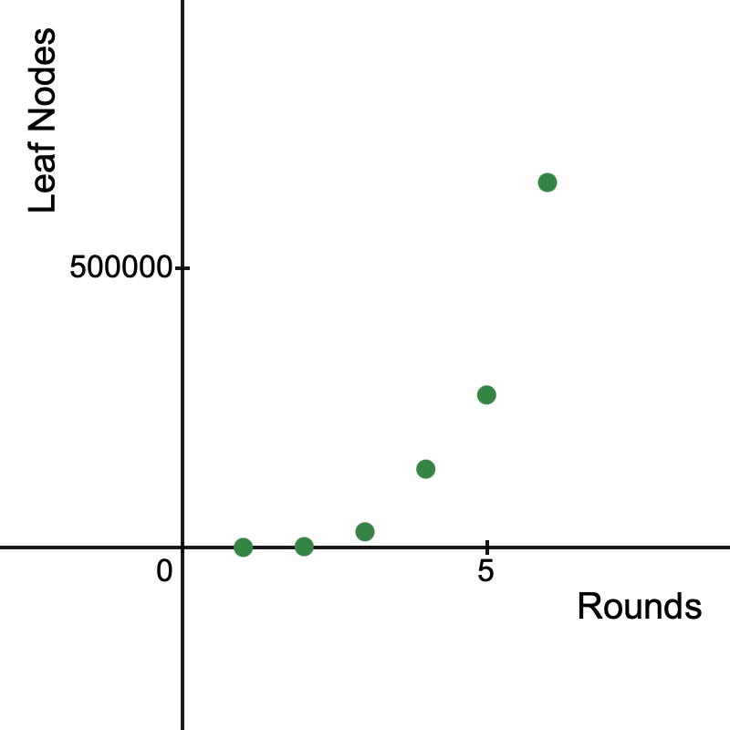
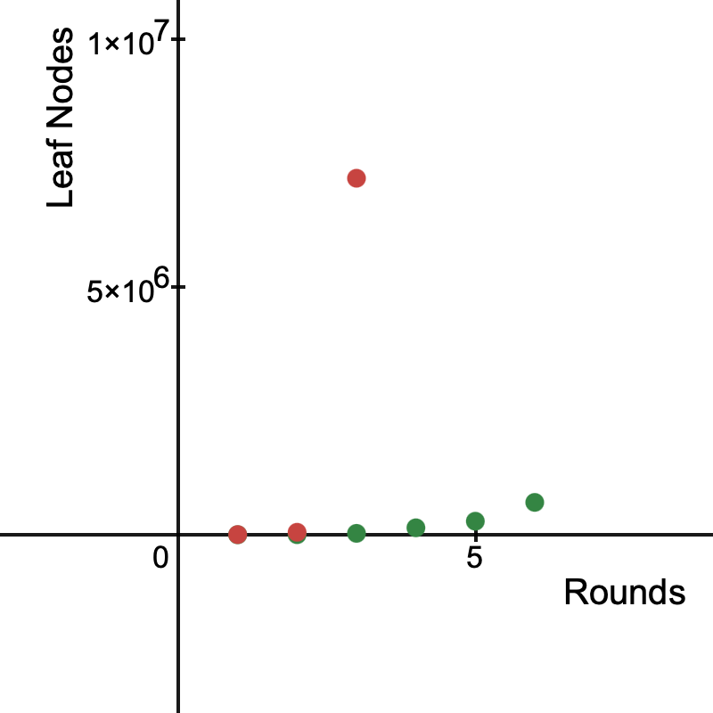

---

marp: true
theme: default

------

# Azul

  

---

# My Inspiration

  

---

# Tree Search Monte Carlo Simulation

* Embarrassingly parallel
* Rapidly growing state space

---

# Finding an Approach

* Extreme scaling challenge

    
    

---

# My Approach

* 2 tiles per row, no duplicate colors
* Breadth-first search

  

---

# Parallelization Method

* BFS supports parallel frontier expansion
* Independent nodes for each level
* Work distribution across threads

---

# Rayon vs OpenMP

* Rayon: work-stealing, dynamic load balancing
* OpenMP: static/dynamic scheduling options
* Memory model differences
* Ease of nested parallelism
* Rust safety vs C/C++ control

---

# MPI + Rayon Hybrid

* MPI for first-level branching
* Rayon for deeper parallelism

---

# Results

(Insert data visuals here)

---

### Scoring Progression

**Step 1 — Score: 2**

|  |  |  |  |  |  |
|---|---|---|---|---|---|
| <b>1/1</b> |   | <b>X</b> |   |   |   |
| <b>2/2</b> |   |   |   |   | <b>X</b> |
| 2/3 |   |   |   |   |   |
| 2/4 |   |   |   |   |   |
| 2/5 |   |   |   |   |   |

**Step 2 — Score: 10**

|  |  |  |  |  |  |
|---|---|---|---|---|---|
| <b>1/1</b> |   | <b>O</b> |   | <b>X</b> |   |
| <b>2/2</b> |   |   |   | <b>X</b> | <b>O</b> |
| <b>3/3</b> |   |   | <b>X</b> |   |   |
| <b>4/4</b> |   |   | <b>X</b> |   |   |
| 2/5 |   |   |   |   |   |

---

**Step 3 — Score: 18**

|  |  |  |  |  |  |
|---|---|---|---|---|---|
| <b>1/1</b> | <b>X</b> | <b>O</b> |   | <b>O</b> |   |
| <b>2/2</b> |   |   | <b>X</b> | <b>O</b> | <b>O</b> |
| 2/3 |   |   | <b>O</b> |   |   |
| 2/4 |   |   | <b>O</b> |   |   |
| 4/5 |   |   |   |   |   |

**Step 4 — Score: 43**

|  |  |  |  |  |  |
|---|---|---|---|---|---|
| <b>1/1</b> | <b>O</b> | <b>O</b> | <b>X</b> | <b>O</b> |   |
| <b>2/2</b> |   | <b>X</b> | <b>O</b> | <b>O</b> | <b>O</b> |
| <b>3/3</b> |   | <b>X</b> | <b>O</b> |   |   |
| <b>4/4</b> |   | <b>X</b> | <b>O</b> |   |   |
| 4/5 |   |   |   |   |   |

---

**Step 5 — Score: 55**

|  |  |  |  |  |  |
|---|---|---|---|---|---|
| <b>1/1</b> | <b>O</b> | <b>O</b> | <b>O</b> | <b>O</b> | <b>X</b> |
| 0/2 |   | <b>O</b> | <b>O</b> | <b>O</b> | <b>O</b> |
| 2/3 |   | <b>O</b> | <b>O</b> |   |   |
| 2/4 |   | <b>O</b> | <b>O</b> |   |   |
| <b>5/5</b> |   | <b>X</b> |   |   |   |

**Step 6 — Score: 75**

|  |  |  |  |  |  |
|---|---|---|---|---|---|
| 0/1 | <b>O</b> | <b>O</b> | <b>O</b> | <b>O</b> | <b>O</b> |
| <b>2/2</b> | <b>X</b> | <b>O</b> | <b>O</b> | <b>O</b> | <b>O</b> |
| <b>3/3</b> |   | <b>O</b> | <b>O</b> | <b>X</b> |   |
| <b>4/4</b> |   | <b>O</b> | <b>O</b> | <b>X</b> |   |
| 2/5 |   | <b>O</b> |   |   |   |

---

# Questions
